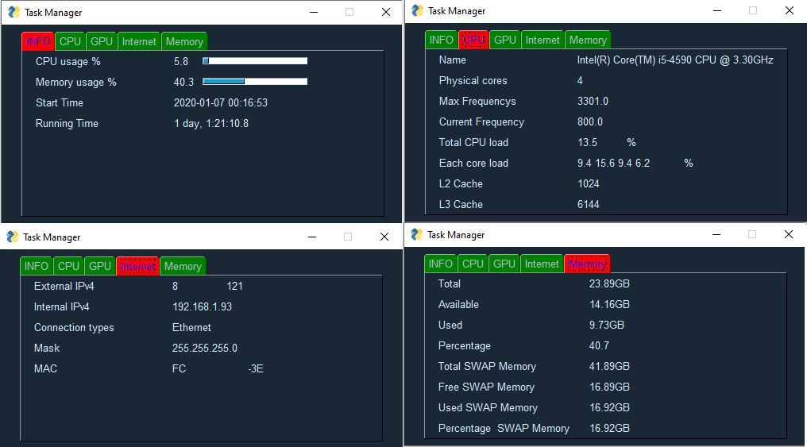

# GUI_of_Task_Manager
Simple program to show current loadage of CPU/Memory/Running time plus information about Network.
Below it is current version of this Task Manager. In future I plan add information about GPU and export data to csv.

